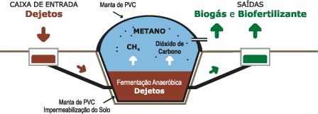

# SESI: do lixo para o laboratório
**Aluno:** Matheus dos Santos Neves  

# Git Pages: https://matheus-sneves.github.io/Grand-Prix/

## Contextualização e Visão Geral
As escolas geram diariamente resíduos orgânicos e plásticos.  
Com base em uma pesquisa realizada junto a funcionários da escola, foi identificado que os principais materiais descartados são **restos de comida da cantina** e **copos plásticos**.  

O projeto **SESI: do lixo para o laboratório** busca transformar esse desafio em oportunidade:
- O lixo orgânico da cantina vira **biogás e adubo**.  
- Os copos plásticos descartados passam a ser **reutilizados em impressoras 3D**.  

---

## Eixo 1: Biodigestor Escolar (Resíduos Orgânicos)

### Materiais Reutilizáveis
- Sobras de comida da cantina (restos de almoço, cascas de frutas e legumes).  
- Caixas d’água ou tambores plásticos (500–1000L sem uso).  
- Tubos e conexões de PVC (restos de obras).  

### Materiais Recomendados Comprar
- Válvula de segurança → libera excesso de pressão.  
- Manômetro → monitora a pressão interna.  
- Queimador de gás → adapta o biogás para uso direto na cozinha da escola.  

### Benefícios
- **Econômico:** redução nos gastos com gás de cozinha e adubo químico.  
- **Ambiental:** menos lixo orgânico enviado a aterros e menor emissão de metano.  
- **Educacional:** aulas práticas de ciências, química e sustentabilidade.  

### Previsão
**Tempo:** 4 a 6 semanas para construção e instalação.  
**Custo estimado:** R$ 800 a R$ 2.000.  

Esse valor se refere principalmente à compra dos itens de segurança (válvula e manômetro) e do queimador de gás.  
Os tambores e tubos podem ser reutilizados, reduzindo o custo total.  

  
  
  

---

## Eixo 2: Laboratório 3D Circular (Plástico)

### Materiais Reutilizáveis
- Copos plásticos descartados na cantina e em eventos escolares.  

### Operação
- O corte dos copos será feito manualmente, sem necessidade de máquinas adicionais.  
- O material cortado será utilizado diretamente na impressora 3D já disponível na escola.  
- No futuro, poderá ser oferecido um curso de impressora 3D com direito a certificado.  

### Benefícios
- **Econômico:** não será necessário comprar materiais para impressão 3D, pois os copos substituem os insumos comerciais.  
- **Educacional:** contato direto com tecnologia de ponta e aprendizado sobre reaproveitamento de recursos.  
- **Funcional:** a escola poderá produzir peças de reparo, móveis e objetos personalizados.  

### Previsão
**Tempo:** 1 a 2 semanas para organização do laboratório.  
**Custo estimado:** R$ 5.000 a R$ 15.000.  

Esse valor corresponde ao investimento em impressoras 3D e equipamentos básicos de uso.  
Como a escola já possui impressora, o custo real se restringe a manutenção e insumos simples.  

  
  

---

## Impactos Esperados
- Redução significativa do lixo orgânico enviado a aterros.  
- Produção de biogás suficiente para parte da cozinha da escola.  
- Economia com gás de cozinha e materiais de impressão 3D.  
- Ao invés de descartar copos plásticos, a escola passa a reutilizá-los como matéria-prima para impressão.  

---

## Expansão do Projeto
Este projeto pretende ser um modelo replicável.  
Queremos mostrar a outras escolas que é possível:  
- Reutilizar copos plásticos em impressoras 3D.  
- Transformar restos de comida em energia limpa para a cozinha.  
- Integrar educação e sustentabilidade em um sistema prático e acessível.  
